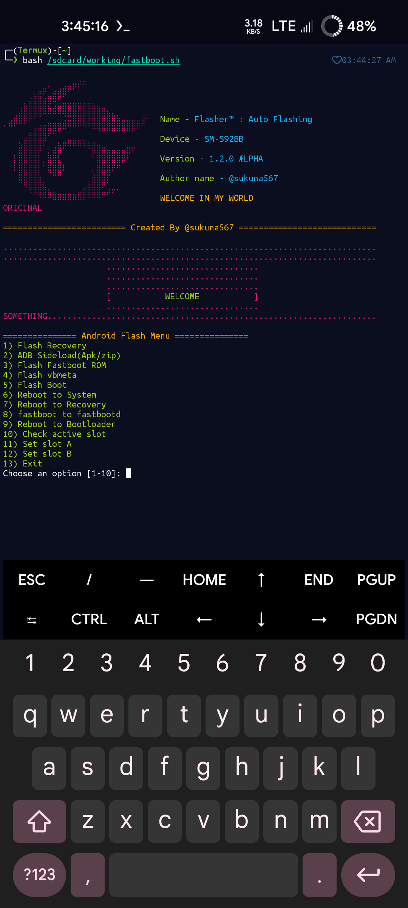

# Termux-flasher script
It's a termux based script for flashing files Automatically. Auto partition layout detection and auto detects recovery partition n flashes recovery without giving error.

Credit: offici5l for adb connection




# flasher-Installation 

```
https://github.com/sukuna567/flasher.git
```
Give Permission With
```
chmod +x flasher.sh
```

# Run

```
./flasher.sh
```
