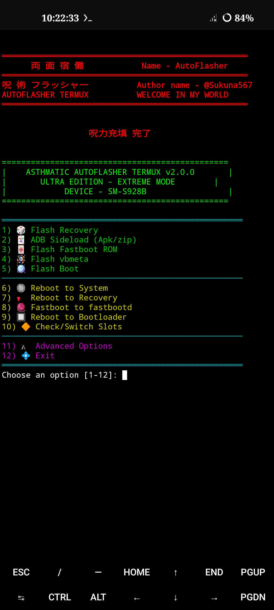
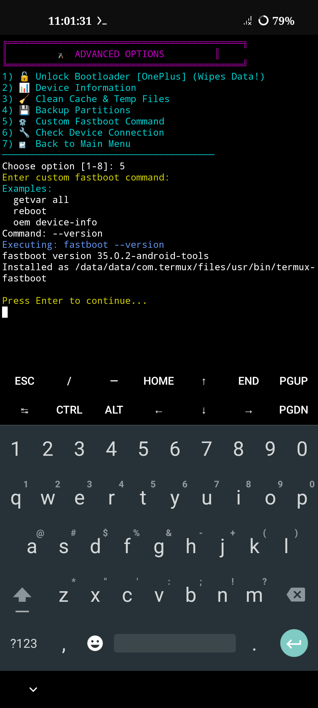

[](https://github.com/sukuna567/flasher/blob/main/LICENSE)
# Termux-flasher
It's a termux based script for flashing files Automatically. Auto partition layout detection and auto detects recovery partition n flashes recovery without giving error.

Credit: offici5l for adb connection

<div align="center">
  
  
</div>


# Installation 

Install [Termux](https://f-droid.org/repo/com.termux_118.apk) & [Termux-api](https://f-droid.org/repo/com.termux.api_51.apk) apk


```
curl -s https://raw.githubusercontent.com/sukuna567/flasher/main/flasher_installation.sh | bash
```

# Run

```
flasher
```

# All Functions Will Work Auto
No need to rush it will handle all alone.
